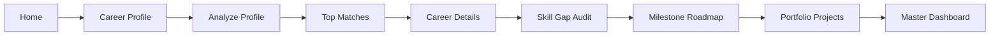

# AI Career Path & Job Guidance System

> **IBM SkillsBuild AICTE Internship Project**  
> **Sustainable Development Goal**: [UN SDG 8: Decent Work and Economic Growth](https://sdgs.un.org/goals/goal8) (Target 8.6: Substantially reduce youth not in employment, education or training)

---

## 📌 Original IBM Problem Statement
> **“Many skilled individuals in Tier-2/3 cities face employment challenges. This AI project will suggest personalized job paths based on user skills and interests.”**

---

## 🌟 Project Overview
Graduates and aspiring professionals in Tier-2 and Tier-3 cities in India face distinct employment hurdles, including limited local tech employer presence, campus placement disparities, lack of personalized career counseling, and uncertainty about which industry skills to prioritize.

The **AI Career Path & Job Guidance System** is a full-stack web application designed to solve this challenge. It provides:
1. **Explainable Deterministic Matching**: A multi-attribute recommendation algorithm evaluating Skills (40%), Interests (25%), Education (15%), Experience (10%), and Work Preferences (10%).
2. **Authentic AI Guidance**: Backend-powered Google Gemini LLM integration producing personalized career summaries, strengths analysis, and custom action plans.
3. **Graceful Fallback Mode**: Works 100% reliably even offline or without an API key. Fallbacks are clearly labeled so you never get misleading claims.
4. **Diagnostic Skill-Gap Analysis**: Side-by-side verification of matching skills vs. high-priority missing skills with realistic time estimates.
5. **Zero-Cost Learning Roadmaps**: Milestone-based curriculum connecting students to free, accredited resources (IBM SkillsBuild, NPTEL, Coursera Audit, FreeCodeCamp).
6. **Portfolio Project Blueprints**: Concrete project architectures and resume impact descriptions to build tangible proof of competence.

---

## 🏗️ System Architecture & Workflow



### Technology Stack
- **Frontend**: React 18, Vite, Tailwind CSS, Lucide Icons
- **Backend**: Python FastAPI, Uvicorn, Pydantic v2
- **Database**: SQLite (via SQLAlchemy) for profile and audit history persistence
- **AI Engine**: Hybrid Layer
  - Deterministic Recommendation Engine (Math & Rule-based scoring)
  - Google Gemini 1.5 Flash (Generative Advisory via backend REST calls)
  - Deterministic Fallback Engine (Transparent, offline-ready guidance)

---

## 🎯 Supported 15 Career Paths
1. **Data Analyst**
2. **Data Scientist**
3. **ML Engineer**
4. **AI Engineer**
5. **Software Developer**
6. **Frontend Developer**
7. **Backend Developer**
8. **Full Stack Developer**
9. **Java Developer**
10. **Python Developer**
11. **Cloud Engineer**
12. **Cybersecurity Analyst**
13. **UI/UX Designer**
14. **Business Analyst**
15. **Digital Marketing Specialist**

---

## ⚖️ Recommendation Scoring Breakdown (100% Total)
To guarantee transparency and avoid arbitrary black-box outputs:
| Component | Weight | Criteria |
| :--- | :---: | :--- |
| **Skills** | **40%** | Overlap with required core skills (28%) + useful skills (12%) |
| **Interests** | **25%** | Alignment with candidate's stated technical domains and interests |
| **Education** | **15%** | Degree and specialization fit (B.Tech, BCA, MCA, B.Sc, etc.) |
| **Experience** | **10%** | Current status, verified student projects, and internships |
| **Preferences** | **10%** | Remote suitability, hybrid viability, and relocation flexibility |

---

## 🚀 Quickstart Guide

### 1. Prerequisites
- **Python**: Version 3.10+ installed
- **Node.js**: Version 18+ or 20+ installed
- **Git**

### 2. Backend Setup
1. Open a terminal in the project root directory:
   ```bash
   cd c:\Users\PAVANI\Documents\AI-Career-Path
   ```
2. Activate the Python virtual environment:
   - On Windows (PowerShell):
     ```powershell
     .\venv\Scripts\Activate.ps1
     ```
   - On Linux/macOS:
     ```bash
     source venv/bin/activate
     ```
3. (If not already installed) Install backend dependencies:
   ```bash
   pip install -r backend/requirements.txt
   ```
4. Set up environment variables:
   Copy `.env.example` to `backend/.env`:
   ```bash
   cp .env.example backend/.env
   ```
5. *(Optional for genuine Gemini AI)* Add your Google Gemini API key:
   - Open `backend/.env`
   - Set: `GEMINI_API_KEY=your_actual_key_here`
   - *(If omitted, the app automatically runs in deterministic fallback mode)*
6. Start the FastAPI backend server:
   ```bash
   python -m uvicorn backend.app.main:app --host 127.0.0.1 --port 8000 --reload
   ```
   Interactive Swagger documentation will be available at: **`http://127.0.0.1:8000/docs`**

### 3. Frontend Setup
1. In a second terminal, navigate to the `frontend/` folder:
   ```bash
   cd c:\Users\PAVANI\Documents\AI-Career-Path\frontend
   ```
2. (If not already installed) Install npm dependencies:
   ```bash
   npm install
   ```
3. Start the Vite development server:
   ```bash
   npm run dev
   ```
4. Open your browser and navigate to: **`http://localhost:5173`**

---

## 🧪 Testing the Complete User Flow
1. Open **`http://localhost:5173`**.
2. Click **"Try Demo Profile (Warangal, TS)"** or navigate to **Career Profile** and click **"Try Demo Profile"**.
   - Loads the official test candidate: Final-year B.Tech CS student in Warangal with Python, SQL, HTML, CSS, and JavaScript.
3. Click **"Analyze Career Path & Generate Guidance"**.
4. Observe **Top Matches**: Software Developer, Full Stack Developer, Python Developer, and Data Analyst appear at top rankings with detailed score breakdowns.
5. Click **"Role Details"** → **"Analyze Skill Gap"** → **"Personalized Roadmap"** → **"Portfolio Projects"** → **"Dashboard"**.
6. Check the **AI Advisory Card** on the Dashboard:
   - If `GEMINI_API_KEY` is configured: Displays `"Powered by Google Gemini AI (Backend Verified)"` with emerald badge.
   - If `GEMINI_API_KEY` is absent: Clearly and honestly displays `"AI Enhancement Unavailable (Deterministic Engine Active)"` with amber badge.

---

## 🔒 Security & Privacy Practices
- **API Key Isolation**: The Google Gemini API key is configured strictly on the backend server. It is **never** sent to the client browser or exposed in frontend JavaScript bundles.
- **Auditing**: All assessment requests are persisted locally in SQLite (`career_guidance.db`) with zero third-party data tracking.

---

## ⚠️ Academic Disclaimer
*This application is an educational prototype developed specifically for the **IBM SkillsBuild AICTE Internship** under SDG 8 (Decent Work and Economic Growth). It provides career guidance and upskilling pathways based on structured skill taxonomies. It does **not** guarantee corporate employment, provide salary assurances, or scrape real-time job vacancies. It is not an official product of IBM Corporation.*
